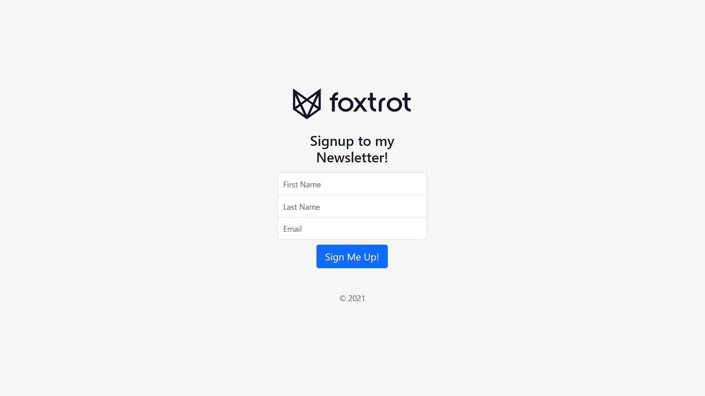

# newsletter-signup
Newsletter signup page using bootstrap, nodejs, expressjs and mailchimp api

 <li>On successfull signup</li>

 <li>On Failure in signing up</li>

## Technologies used

<li>Front-end Technologies - HTML, CSS, Bootstrap</li>
<li>Back-end Technologies - Node.js, Express.js</li>

***API Used :***

`mailchimp api`
 Mailchimp’s Marketing API powers timely, relevant marketing campaigns with custom data pulled directly from your app.

## Getting Started

Run the project using terminal
<pre> Signup on https://mailchimp.com/developer/ to generate your api id and audience key.
 Update app.js file with your app id and audience key.
 cd to project directory
 node app.js
</pre>
 Open https://localhost:3000 to view it in the browser.
